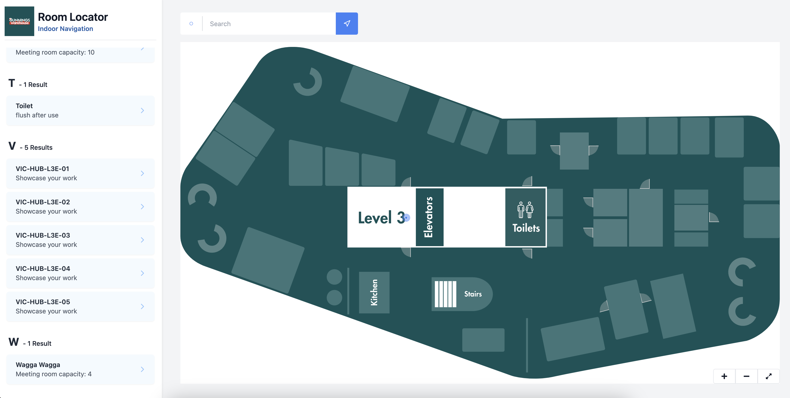

# Bunnings Room Locator: Web-Based Indoor room finder

Bunnings Room Locator is an innovative web application designed to revolutionize indoor navigation. Using interactive maps and efficient path finding algorithms, it offers an intuitive solution for navigating complex indoor spaces.

## Table of Content:

- Bunnings Room Locator: Web-Based Indoor room finder
  - [Table of Content:](#table-of-content)
  - [About The App](#about-the-app)
  - [Features](#features)
  - [Technologies](#technologies)
  - [Setup](#setup)
  - [Technical Insights](#technical-insights)
    - [Map Technology](#map-technology)
    - [Pathfinding](#pathfinding)
    - [Core Map Technology](#core-map-technology)
    - [Path Drawing and Wayfinding](#path-drawing-and-wayfinding)
    - [Customizing the Map](#customizing-the-map)
  - [Credits](#credits)
  - [License](#license)

## About The App

This project is a snag day project to allow users to find rooms once entering a floor.

## Features

- **Interactive SVG Maps**: Navigate complex indoor spaces with ease.
- **Dijkstra Pathfinding**: Calculates the shortest path to your destination.
- **Responsive Design**: Optimized for any device and screen size.
- **Pinch-to-Zoom**: Effortlessly zoom in and out on maps with touch gestures.

## Technologies

Bunnings Room Locator is built with the latest web technologies for speed, efficiency, and adaptability:

- React
- Vite
- TypeScript
- TailwindCSS
- SVG
- Dijkstra's Algorithm

## Setup

Follow these steps to get the project up and running:

1. **Clone the Repository**: Use your preferred Git client to clone this repository to your local machine.

2. **Install Node.js**: This project requires Node.js. If you don't have Node.js version 21 installed, you can download and install it from [nodejs.org](https://nodejs.org/).

3. **Install Dependencies**: Navigate to the project directory in your terminal and run the following command to install the necessary dependencies:

   ```bash
   npm install
   ```

4. **Start the Application**: Once the dependencies are installed, you can start the application by running the following command in your terminal:

   ```bash
   npm run dev
   ```

After running these commands, your default web browser should automatically open and navigate to `localhost:5173`, where you can see the running application.

## Technical Insights

### Map Technology

- **SVG Format**: The map is primarily SVG for its flexibility and interactive capabilities, ideal for detailed navigation.
- **Image Format Support**: Supports various formats like PNG and JPEG for map backgrounds, with interactive features best suited for SVG.

### Pathfinding

- **Routes Definition**: Paths within the map represent navigable routes, essential for the Dijkstra algorithm to calculate efficient paths.
- **Dijkstra Algorithm**: Ensures accurate and swift navigation between POIs.

### Core Map Technology

- **SVG as the Default Format**: The application primarily uses an SVG (Scalable Vector Graphics) file for the map due to its scalability and ease of manipulation. SVGs allow for interactive and dynamic rendering of indoor spaces, making them ideal for detailed navigation paths.
- **Support for Various Image Formats**: While SVG is the default, the system is designed to accommodate any image format (e.g., PNG, JPEG) as a map background. This flexibility ensures that developers can use existing floor plans or maps without needing to convert them to SVG. However, the primary interactive and navigational features are optimized for SVG.

### Path Drawing and Wayfinding

- **Path Drawing**: For navigation to function, paths must be defined within the map. These paths represent walkable routes and are crucial for the wayfinding algorithm. In SVG files, paths can be drawn and edited directly, allowing for precise control over navigation routes.
- **Wayfinding Algorithm**: The application utilizes the Dijkstra algorithm for calculating the shortest path between points of interest (POIs) on the map. This algorithm operates on the network of paths drawn on the map, ensuring efficient and accurate navigation.

### Customizing the Map

- **Editing Tools**: Developers have the option to utilize vector graphic editing tools such as Adobe Illustrator or Boxy SVG for modifying the SVG map. This modification can involve updating layouts, adding or removing Points of Interest (POIs), and adjusting paths. Refer to the screenshot below to see an example of map editing using Boxy SVG. For converting SVG to JSX, [Transform Tools](https://transform.tools/) can be a useful resource.



## Credits

This project was inspired by [maciejb2k's pathfinding app](https://github.com/maciejb2k/pathfinding_app).

## License

Pathpal is open-sourced under the MIT License.
